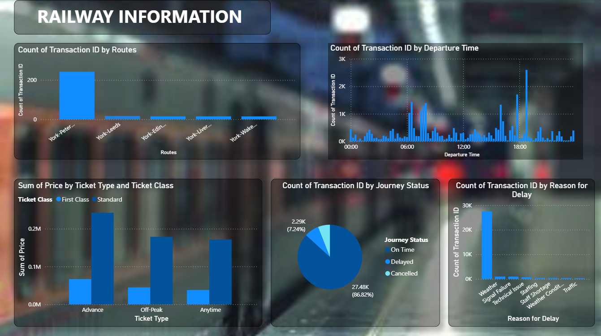

# 🚆 Railway Information Dashboard – Power BI

## 📘 Overview  
The **Railway Information Dashboard** is an interactive Power BI project designed to analyze and visualize key aspects of railway operations and data.  
It provides a comprehensive overview of train schedules, passenger statistics, revenue distribution, and performance metrics — empowering decision-makers with actionable insights.

---

## 🎯 Objective  
- To monitor **train operations**, **revenue performance**, and **passenger trends** efficiently.  
- To visualize **regional performance** and **on-time statistics** for better resource allocation.  
- To enhance **data-driven decision making** within the railway management system.  

---

## 🧾 Dataset  
- **Source:** Railway operational dataset (sample data for demonstration)  
- **Format:** Excel / CSV (connected to `.pbit` template)  
- **Attributes Include:**  
  - Train Name / Number  
  - Origin & Destination Stations  
  - Distance (km)  
  - Departure & Arrival Time  
  - Passenger Count  
  - Revenue Generated  
  - On-Time Percentage  
  - Region / Zone  

---

## ⚙️ Tools & Technologies  
- **Power BI Desktop** – for data modeling and dashboard creation  
- **Excel / CSV** – data source for importing operational and performance data  
- **DAX & Power Query** – for data cleaning and calculated measures  

---

## 📊 Key Features & Visuals  
- **Train Performance Overview:** Highlights punctuality and delay analysis.  
- **Revenue Insights:** Displays revenue trends by train, route, and region.  
- **Passenger Statistics:** Visualizes total passengers carried and occupancy rates.  
- **Regional Distribution:** Compares performance across different railway zones.  
- **Time Analysis:** Analyzes departures, arrivals, and delay frequency over time.  
- **Interactive Filters:** Filter by train type, date, region, and class of service.  

---

## 💡 Dashboard Insights  
- 🚉 **High-performing routes** identified with consistent revenue and punctuality.  
- 💰 **Revenue concentration** in major zones with premium train services.  
- 👥 **Passenger growth** correlates strongly with festival and holiday seasons.  
- 🕒 **On-time performance** improves in southern and western regions.  
- 📅 **Operational delays** mainly occur during peak traffic months.  

---

## 🚀 How to Use  
1. **Clone or Download** this repository.  
2. Open the file **`railway_information.pbit`** in [Power BI Desktop](https://powerbi.microsoft.com/desktop/).  
3. Connect to your dataset when prompted.  
4. Click **Home → Refresh** to load updated data.  
5. Explore the dashboard tabs and interact with filters and slicers.  

---

## 🧠 Skills Demonstrated  
- Data Cleaning and Transformation (Power Query)  
- Data Modeling and DAX Calculations  
- Report Design and Visualization  
- KPI Analysis and Trend Interpretation  
- Interactive Dashboard Development  

---

## 📸 Dashboard Preview  
  
(The above picture is an actual screenshot of the dashboard)*  

---

## 🔮 Future Improvements  
- Integrate **real-time train tracking data** using APIs.  
- Add **forecasting visuals** for passenger and revenue predictions.  
- Embed the report in a **web portal** for broader access.  
- Automate data refresh with **Power BI Service Gateway**.  

---

## 👨‍💻 Author  
**Sai Kumar Reddy N**  
📧 saimanikya8152@gmail.com  
📞 +91-8310023990  
[GitHub](https://github.com/thesaireddy20) | [LinkedIn](https://www.linkedin.com/thesaireddy20)  

---

## 🏷️ Tags  
`#PowerBI` `#DataVisualization` `#Railways` `#Dashboard` `#DataAnalytics` `#SaiKumar`
